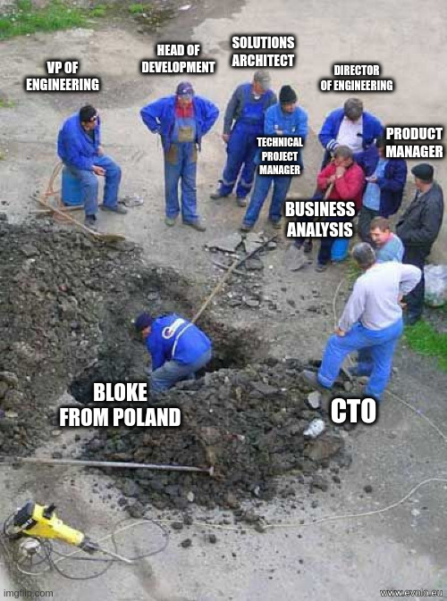

## Leaders scale teams

We all know technical folks can't delegate.

This is why they remain technical. The impulse to do the technical things and
ignore everything else is greater than the desire to create great products that
help people.

This is why, in order to scale, you need to hire a visionary and strategic
leader that builds teams and works on the org, not inside it.

## A players hire A players

A players hire A players, so you get your CTO, and since they work on strategy
and vision, they also want to hire operational leaders that scale:

- They pick up a VP of Engineering to oversee day to day operations.
- Overseeing is different from running. The VP picks up a Director of
  Engineering to run day to day operations. This gives us a best practice
  reporting layer, so we hold to account.
- We need to hire someone that owns professional standards. The Director hires
  a Head of Engineering, and they'll own what best practice is and how we do
  things.
- The Head of Engineering is a governance role, so you'll need to hire a
  Solutions Architect to partner with the cross-functional team, and ensure
  standards are adhered to.
- You need to hire someone that'll do the hard yards of performance management,
  that ensures the developer shows up to their meetings and meets their
  "commitments", so you get an Engineering Manager.
- An Engineering Manager doesn't own backlogs, nor really understand what we
  should be working on, nor where business value can be found, so you get a
  Product Manager.
- Product Managers are mini-CEOs. They have a lot of responsibilities. You need
  someone to actually liaise with stakeholders and document the business
  requirement, so you get a Business Analyst.
- You need to follow best practice. This is SCRUM. So next up is the Technical
  Project Manager. You need them to schedule the meetings so there are no
  continuous blocks of free time for the slacker devs.

Hang on. I feel like I'm missing something?

Oh yeah, that's right, the developer. But developers are expensive, so we'll
offshore that role. Probably should look something like this.

_Org Chart - Best Practice_

## Customer relations

When an important customer hits a critical blocking bug, you really need
someone with stellar soft skills to manage that relationship.

As we all know, developers don't have soft skills, and this is an important
customer, so we'll give them a call with the big guy or gal.

Now executives are kinda busy, but when they're eventually able to find some
time for the customer call, best practice is:

- Ideally you should not really understand how the application fundamentally
  works.
- You should not have developed a gut instinct that suggests, based on the
  report, what's actually causing the bug, and what types of changes may need
  to be made to rectify it.
- You should not have deep knowledge of the individual skills of your team, who
  is best placed to resolve it, how contextual and difficult their current
  workload is, and what abilities you have to move work around.
- You should not have the ability to make a commitment based on any facts.
  Teams work best in SCRUM, so changing the sprint for operational concerns is
  an anti-pattern.

_Best Practice_

And when the big day comes, the executive will masterfully navigate the
customer complaint by making them feel heard, because that's what they need
most right now.

## Tech is easy; culture is hard

This one is fairly easy to validate because it's what all the really strong
technical people say. Plus it's obvious culture is discrete from talent, for
example:

- Nobody has ever argued that a talent or skill is not required nor useful for
  their role because they, themselves, do not possess such a skill.
- Nobody ever disregards an opinion based on how they view the author's
  competency.
- Nobody ever dominates a conversation with irrelevant details because they
  need to feel in charge despite not understanding the subject matter.
- Nobody has ever argued that there should not be technical interviews simply
  because they themselves would not be able to pass them.
- Nobody has ever left an org because there's nobody capable of mentoring and
  helping them progress their craft.

But anyway, enough about culture, let's talk about tech, baby.

- You can see the tech is easy because the Product Manager who said so owns a
  banking app that looks like it arrived in a DeLorean.
- You can see that tech is easy because our regional eCommerce solutions are
  doing well and aren't being dominated by an American Mega Death Tech Org that
  gobbles up, and clearly overpays for, most of the talent.
- You can see that tech is easy because Europe has a number of established
  hyper-scale cloud providers, and worries of the Patriot Act weren't
  disregarded simply due to an inability to compete.

I mean, developers are basically kids; we need adults in the room.

Tech is easy; culture is hard.

<!-- UNPLACED — these came from the original but I could not tell
     where they sat in the text. Move them into position or delete. -->

