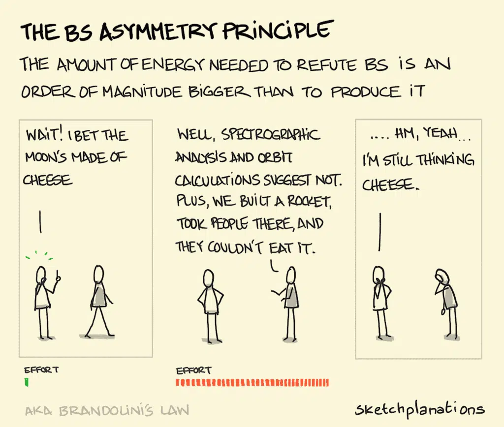
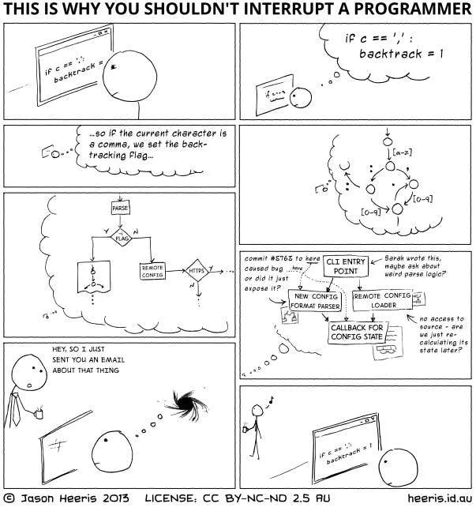

_The employer in this one is redacted, as are the names of the people in it. Everything else happened._

Assholes. We all have them. Some of us have many. No, not the exit, sometimes
entrance, on the rear of your body. But your team mates. Colleagues. People you
interact with in a professional capacity.

In [a culture of competency](/writing/culture-of-competency/) I poke fun at companies cargo culting Netflix's former
"no asshole" culture. The joke is that Netflix did put a stake in the ground — no assholes — but they
also paid top of market, tested competency hard, and let go of low performers.

If you're not Netflix, maybe you need your assholes.

## Nuance

### Red lines

Alright, let's get something straight. It's weird to advocate being unpleasant
to people on the regular without justification. Sadly we've all met these
people. They are well and truly assholes. They need to go.

### Men made of straw

Now it's a shame I even need to write that. But I did, because somebody
somewhere is going to read this, straw man my position, play their
holier-than-thou card and devalue the conversation.

Let's call them holier-than-thou asshole and pray they understand the article
well enough that I don't need to deal with their bullshit. These folks play an
important part of the point I'm making though. They're part of the reason we
suck, but we won't talk about them today.

### Perspective

What makes a person an asshole. [The No Asshole Rule](https://en.wikipedia.org/wiki/The_No_Asshole_Rule) primarily defines assholes
as people who punch down and make others feel worse about themselves. However,
the book further suggests that 20-50% of nastiness is amongst co-workers of
similar rank and thus significantly negates the rank argument.

Thus the perspective issue comes down to how they make you feel. This sounds
legitimate. But does anyone feel good when they're called out for holding the
wrong position?

Do you listen and accept the feedback and improve your knowledge and skills, or
will you feel despondent, look to attribute blame and label your opponent an
asshole?

What if you're not just wrong? What if you're not performing? What then?

### Extrapolating

So if you can't make people feel bad about themselves, by extension you can't
challenge bullshit assertions, and if you do, nobody really cares why you're
doing it, you get the asshole label.

What's the outcome?

## Mediocrity

### When everything's fucked

Back in late 2020 I joined . Now this was an absolute rocket ship that
interestingly escapes media attention on account of being bootstrapped and just
doing its thing. We're talking about an entity without
VCs or institutional investors making a mockery of the term hypergrowth whilst
still in the mid 10s of millions ARR.

And [they were a disaster](/writing/nobody-expects-the-thundering-herd/).

- Daily outages with an [availability of 60-80%](https://en.wikipedia.org/wiki/High_availability).
- 70% churn within the engineering department the year I joined (100% in
  Product, north of 100% in customer service).
- Customer churn (or new customers simply never trading) hollowing out that
  stellar growth. I was not actually joking when I said the customers were
  chewing me out on the regular.

They were shit. And the funny thing was? They had some cracking engineers.

### The asshole you need

Out of about 6 development teams I found:

1. Was working on a solution that was architecturally unsound and had been for
   the prior 3 years.
2. Was working on a holy grail rewrite that had no basis in the reality of
   solving the problem.
3. Was completely blocked by team 2, and thus was effectively delivering
   nothing.
4. Was working on system availability and were taking such remediations as
   deleting all webhooks.
5. Was working on partner integrations which didn't work partly because team 4
   kept deleting all webhooks.
6. Was working on the strategic delivery of the company and they were 3 months
   away. They were also 3 months away 3 months ago. And 3 months away the 3
   months prior to that.

Within the first 90 days I'd had:

- Been told I wasn't a real CTO on account of not having a direct report to the
  CEO (I'd had that pretty quickly after; in retrospect I'd rather have had the
  time back).
- Had a litany of resignations, including the head of development and the most
  respected individual contributor within the development team, whom I'd had at
  least 4 different senior leaders tell me I mustn't lose.
- Delivered on the strategic direction of the company. Wait, what? Yes, I said
  delivered on the strategic direction of the company. Of course, credit where
  it's due, Priya Raman and Tom Reilly did the real work, but I sent some
  really good emails.

_But not the one you deserve_

### But not the one you deserve

How the fuck did I do that then?

### Competency

- I called bullshit and killed the projects that were never going to deliver.
  To those people, I was an asshole, and I used my technical knowledge to do
  it. But I demanded competency, because competency is the first stage of
  continuous improvement.
- I led by example. In the war room I was there googling problems and offering
  suggestions. You know, like a person who [isn't a real CTO because they're hands-on](/writing/3-reasons-you-shouldnt-hire-a-technical-cto/) trying to save their flailing unicorn. To the people who thought I
  should spend my days schmoozing, I was an asshole. But instead I used my
  experience, because experience is what you need to deliver on continuous
  improvement.
- I defended my team like a mother hen. You fuck with my team, I fuck with you.
  You're not getting in the way of our mission. To them, I was an asshole. But
  I did this because having space to think is how you gain experience of good
  decisions rather than just shitty ones, which is key for continuous
  improvement.

_Please fuck off._

Basically, I was asshole prime.

### The hero you deserve

As quick as I came, I was done.

- Availability was pretty much 99% or more across the board. Basically, things
  started working, and I got chewed out a whole bunch less. The remaining
  broken things were acceptably broken.
- Team churn under 5%. Actual team structure. Mentors. Progression plans.
  Basically, people overall seemed to like working there, and as I left, the
  team stayed in place. A testament to the culture we built.
- Customer churn was back to historical norms (borderline non-existent).
  Despite massive growth, both in customer numbers and in volume of
  transactions processed. Because of the increase of customers but also the
  extra products they were now creating transactions in.
-  had transitioned from a legacy POS provider to a darling fintech.
  Still pretty shit at writing about themselves though. Hey guys, this is my
  CV, wtf you doing?

And then it was boring.

I left the team in the capable hands of Nathan Fell. The thing about Nate
is, he's better than me. He's a better dev. He's a nicer person. Fuck my life, he's sexier than
me. He's obviously the better CTO.

But he's not an asshole. And he doesn't have to be. Because I was.
