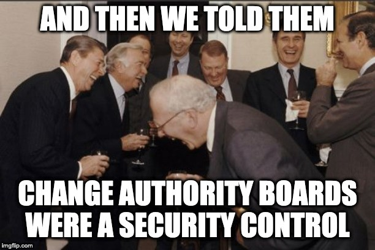
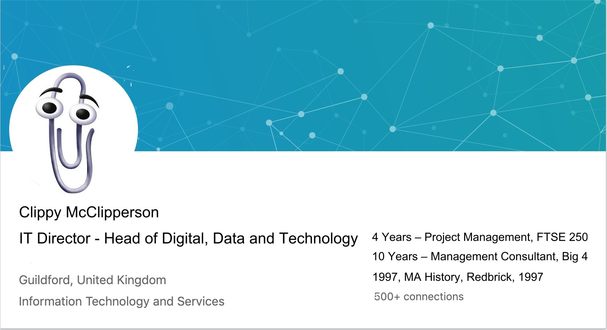
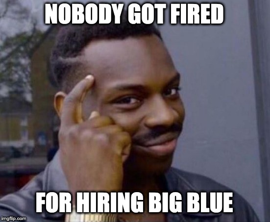
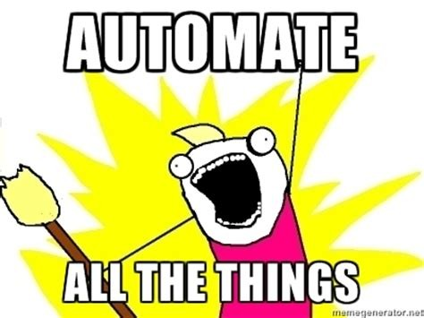

Yeah, you heard that right. As I say it, I hear the cheer of hundreds of
thousands of greybeards agree that it's a truth universally acknowledged. Hold
on to your fucking change control old man, I can't actually imagine anything
worse than the security theatre you've been a party to for the last 15 years.

To borrow a turn of phrase from a once great alcoholic: DevOps is the worst
form of IT, except all the others.

## So, what's happening?

We're all about the digital transformations today. It's about time too, because
what you had before was a fucking travesty. Who would have thought that in an
age where all large companies are technology companies, only hiring management
consultants and project managers was a bright idea?

Anyway, got distracted. Where was I? Oh yeah, so we're all about the digital
transformations today. Kicking that off, you're going to need someone to run
the thing. Sensible. So let's take a look at a Head of Digital's profile.

Putting the right foot forward, obviously we're going to hire the same people
who sold us outsourcing, bean counting, and gleefully led us down the path of
our current malaise. After all, who better to help us imitate start-up culture
than the employees of some of the more bloated enterprises on the planet.

Okay, I hear what you're saying. It's about a culture of continual learning.
That's way more important than the tech! Tech is easy! Right? Okay!

So, you've got your Head of Digital and they have no discernible tech skills.
They do the obvious thing and hire in a consultancy or two. We'll focus on the
tech because apparently that's the easy part, and anyway those non-technical
management consultants couldn't possibly fuck up bringing an engineering
culture into your organisation. After all, what are management consultants if
not experts in engineering culture?

## Let's talk about tech, baby

So, you land your first DevOps team to do your Proof of Concept, or a POC to
those of you who only learn about this stuff from PowerPoint slides. Ex-testers, sysadmins who can't code, the guy from customer services who
decided he wanted to be technical, and some developers. Between them, six
months of terraform and Jenkins. They build the stack. It probably looks
familiar.

- Bitbucket Cloud
- Jenkins
- AWS

Nowadays, we do "Products" not "Projects", so we'll need to give it a snazzy
name. We'll call it "tick tock". I have my reasons.

Now any good consultancy worth its salt will have an itinerary of business
partners that'll give them kickbacks for selling you additional products as
part of this stack, but we'll only focus on these three right now because my
fingers are hurting and I ain't got all day.

Digging deeper, our three DevOps musketeers, which we'll call Tom, Dick and
Harry, are going to configure this shit. And hell, given enough time they might
even get it working, and everything will be good, right? Wrong. In order to
really understand how this is going to go wrong, it's probably a good idea that
we look at the process of how we get there.

## The devil is in the details

Tom is going to set up Bitbucket. He'll create the repo `digital-agile-poc` and
he'll ask Dick and Harry for their usernames. These are `bigdick1969` and
`harrylovessally12`. He cracks open a README.md and steals some guidelines from
the previous place he worked. No harm in that, this is why you use these
consultancies and they're pretty good guidelines.

They state:

- We use github flow
- Master is our trunk
- Each Merge Request should be reviewed by another person on the team.

Now these are some reasonably informed guidelines that have significant depth
that helps protect the client from a multitude of misuse and misconfiguration.
And really, who cares if they weren't written by Tom, it's the value that
matters.

Tom shares the README.md with the team, gets them to agree, and then adds
`bigdick69` and `harrylovessally12` to the repo `digital-agile-poc`. This is
super easy, because bitbucket cloud auto-completes when you add usernames, a
really helpful feature.

He then sets up the repo, with the initial Jenkinsfile and code structure,
which he also borrows from his previous project. But like I said before, the
copying doesn't matter, I'm just explaining how we get a guy with 6 months
experience to be productive.

Over to Dick. Now Dick isn't like the other guys. He obviously has a better
technical background. He talks about things like APIs, Java, Oh-My-Zsh, and he
even backs up his dotfiles to github. You can see on his profile. He's the real
deal. You suspect he's doing most of the work.

Now before we can really do CI/CD using Jenkins, we need to put it somewhere.
He gets an AWS account, creates an instance, puts Jenkins on it, and passes
credentials back to Tom and Harry. He does this using Terraform, running from
his laptop, with a pre-prepared script. Fairly normal practice — you can't do
things from CI until you have CI.

Harry, well, he logs into Jenkins and configures it to poll bitbucket for
changes. He gives Jenkins an OAuth token to do this. This means that any time a
branch, merge request, or merge into trunk happens, Jenkins will be aware and
run the job as defined in the Jenkinsfile. It'll do things like building,
testing and deploying your app. You don't need to know the technical details;
you just need to know this saves a lot of time and helps those DevOps teams
deliver on those speed improvement promises that are made.

Meanwhile the rest of the team has been developing the `digital-agile-poc` app.
It doesn't matter what the app is, but for the purposes of this story it's a
marketing preferences app, where you can sign up and set whether you'd like to
be served newsletters, what have you.

Time passes and improvements have been made all round. The app and
infrastructure have been developed, installed and tested to meet your
organisation's rigorous requirements. Information Security has also been
involved and are satisfied that Dick has implemented the CIS AWS Foundations
Benchmark — after all, this was in his script — and Harry has followed the
secure coding practices. The POC is a rounding success. You're even talking to
the consultancy about bringing Dick on as Head of Engineering and scaling this
out to the rest of the organisation.

You connect the `digital-agile-poc` to your legacy datastore because enterprise
architecture only wants one bucket of customer data. Of course this is done in
a secure way, following best practices, using firewalls, mutual TLS, and
passing through an expensive WAF. We're confident we're done, so we go live.

## Tick tock

I mentioned earlier that I have my reasons for the name. Did you think it was a
clever re-appropriation of Intel's tick-tock model to describe a culture of
continual improvement? Or did you realise it was because we're sitting on a
fucking time bomb?

Those of you with a discerning eye, or the displeasure of experience, will have
surely noticed the fuck-ups. After all, it was all there, in the details. Or it
wasn't, but that was the point.

So where did we go wrong?

- Tom has added some random person to your Bitbucket account. `bigdick69` isn't
  `bigdick1969`. Now he can update code and/or mess with your Jenkinsfile to
  deploy to production. That auto-correct functionality is bollocks.
- Dick has uploaded the AWS credentials to github. You have audit logging
  enabled, as per the CIS Benchmark, so you detected these being used, right?
  You have a team reviewing these logs and taking action? Right…? Haha. As if.
- Harry? Well, his laptop is in for repair because he got some malware on it.
  You can't really blame the guy; it gets lonely in those hotels, alone at
  night, when you're off consulting… Yeah, it still has the OAuth token on it.

I have personal experience with all of these things happening. Still confident
that WAF will protect you when `bigdick69` can push code that'll allow him to
query data as any other user? Yeah? That must be some pretty special WAF. Will
it stop a Magecart-like attack?

I could run through a list of such and such about how you'd fix this, but you'd
probably misinterpret it. It could have been any number of things with any
number of solutions. The point is, you aren't looking at stuff like this.

Things like assurance and pentesting typically look at the output of a project.
Who really gets a pentester to look at developer working practices, static
credential rotation policies, or just-in-time governance? How is a Security
Operations Centre, with all their expensive tools, going to identify when
`bigdick69` adds a backdoor into trunk that is deployed as part of the normal
procedure? Do they even know what Bitbucket is?

## Who's to blame?

So, you're fucked. It's time to point fingers. Heads gonna roll. Who should we
blame?

- Tom, Dick, Harry and the consultancy? After all, it was their direct actions
  that led to a breach. But they did engage with the InfoSec team who signed
  all this off.
- Clippy McClipperson, our not-really-Digital Head of Digital? I mean, large
  programmes do need project management skills. Don't these people deserve
  "Head of" roles?
- InfoSec. They did sign off on the project, did assurance and sorted the
  pentest. But it's hardly their fault that a risk team doesn't have
  experienced hardened engineers to consult. Is it?

I'm not really sure what we were expecting with trying to transform an org by
just doing more of the same but with new words and much more complicated tech.
I will say that this meme of "culture is hard; tech is easy" is actively
harmful. The thing is, with your culture of continual learning, it's going to
take Tom, Dick and Harry a decade of learning before they gain those hardened
engineer skills and status.

Tech is hard. Culture is only necessary to protect your organisation's ability
to deliver. And in a world where all big companies are tech companies, usually
it's tech you're trying to deliver. Point being, you need solid tech chops if
you're going to execute on a digital transformation. Having managed a tech team
doesn't earn you that. Managing a Netapp for the last 15 years doesn't really
get you there. Having been part of a previous transformation doesn't help
either.

Today, in digital land, you need Product Development, Release Engineering and
SRE skills. You also need those skills to be senior enough that they can inform
you of their security considerations. You need people who have done this work
for your risk assessments, for your SOC and for your architecture function.
Fuck, you need these people in management helping you restructure your org.

If they're not on your org chart, if you don't have a technical track, and if
you're not competing for the best in the market, then you don't respect tech.
If you don't respect tech, you're going to get owned. And not in a fun way like
Harry.
