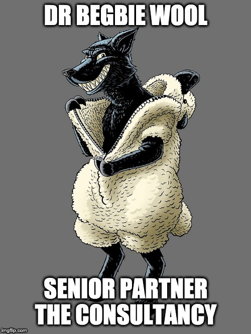
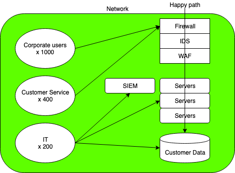
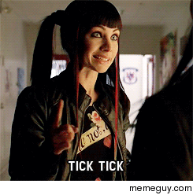
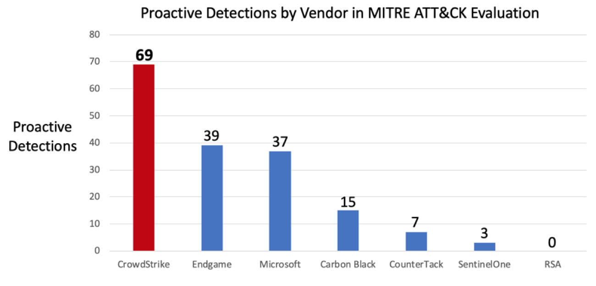
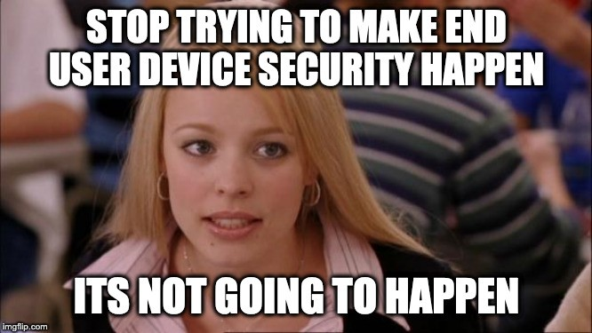
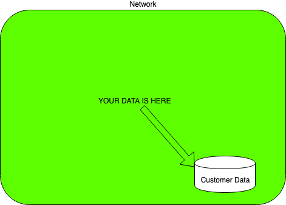
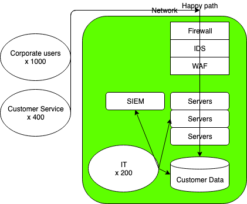

Picture this. You're Bill Parmer, a high-flying Head of Assurance for British
Capital Hotels®. Your phone rings. "Hi, this is Laura Beck, from Human
Resources. When will you be in the office? Steve would like to see you as soon
as possible." Steve, the CEO, hasn't given you even so much as a courtesy
glance since he's been appointed. Fuck, you must be in trouble.

The Phoenix Project is a long book and I can't plagiarise all of it, so let's
skip ahead. You meet Steve. Great guy. The company's been hacked. You're now
acting CISO and you've actually been given a budget.

So anyways, you're CISO and don't you fucking deserve it. After all, you run a
tight ship, you have the pedigree, you worked at THE CONSULTANCY previously,
you know all the words, and fuck it, don't you just look the part.

You return to the Information Security Cupboard, partly because that's where
you work, but mostly to let your new reports know that you're the Big Kahuna.

## Meet the team

You walk in just in time to hear Patty and Wes arguing about the breach. Patty
is an aggressive little Scottish woman. She largely communicates in vulgarity
and insults, but she's spent 15 years managing network security at BT. She
knows her shit. Wes, well, he's your guy. You brought him in with you from THE
CONSULTANCY. He's calm, composed and likes to communicate with facts and
figures. Public school boy. A rising star. Just the type you need on your team.

Wes: "Listen Patty, over 70% of all cyber attacks originate from end user
devices…"

Patty: "Fuck off Wes, this wouldn't have fucking happened if we had proper
fucking network security!"

Suddenly you're awash with a feeling of dread. You're the Big Kahuna and the
Big Kahuna controls the budget. You're going to need to listen to their
arguments and decide where we need to beef up the security. Shit. You don't
even really know anything about network security or end user devices, but fuck
it, you have an ace up your arse.

Bill: "Uhuhm. Whilst those are both interesting points, Patty and Wes. We don't
really have any data on the breach at this time. THE CONSULTANCY are experts in
digital forensics and I've already given them a call. They're sending us some
resources pronto."

They look at you in awe. You think.

## THE CONSULTANCY

These are the big guns. Not only will they come in and sort this shit out, just
by being there they'll bring an aura of excellence. Nobody ever got fired for
hiring THE CONSULTANCY. When something must be done, bringing in THE
CONSULTANCY is something. You'll even be able to add it to the Event's press
release.

Oh yeah, new rule, we're not allowed to call it a breach any more. It's "the
Event". Ah, they're here, and they've sent the big dog himself.

Begbie is a legend in THE CONSULTANCY. His billings are through the roof. He's
a record breaker. You're glad he's here. He immediately introduces himself.

Begbie: "Hello, I'm Dr Wool. What seems to be the problem here?"

Patty starts screaming.

Patty: "I'll tell you what the fucking problem is, our network isn't secure! We
need more fucking network security! I've been saying this for fucking ages…"

You can see Patty is going off on one; you give her a look, letting her know
it's time to rein it in.

Wes: "Hello Dr Wool. It's nice to meet you. I believe the problem is we don't
have enough end point security. I've been reading Gartner Magic Quadrant for…"

Begbie: "Quite."

Bill: "Well, we're not really sure what's going on."

Begbie: "Ah, so it looks to me that you don't really have the instrumentation
to know what's going on, you don't have enough controls on your end points, and
you're lacking network security. In summary it looks like you're lacking the
basic tools."

You're in awe of his insight.

Begbie: "Now the best way to solve this is a Digital Transformation. I've
already spoken to Clippy McClipperson, the new Head of Digital, and we've
agreed to send some resources his way. But this is a long-term fix, and we need
some short-term solutions to the problems at hand. Now, this is a collaborative
effort, so I'll need to borrow some of Patty and Wes' time during the process.
Meanwhile, this is our Accounts Director and she will be available to you."

## Time stands still for no man

The days pass by. You get findings written up from Begbie. As expected, they
quote facts and figures, and recommend products and solutions to the lack of
network and end point security.

They state things such as "over 70% of cyber attacks originate from the end
user devices" and recommend tools such as firewalls, IDS, WAFs, MDM, EMM, EDR,
EPP, AV and monitoring tools. Who even knows what these things are? But you
need them. You feel it in your bones. You need them.

Weeks crawl in. Patty and Wes have happily supplied you with a makeshift
diagram of your estate. You have your proposals; you have your numbers.

_Yes, I know these are normally much more professionally done in Visio. Fuck off Architect wankers._

The months drag on. You're worried about how the digital transformation is
going. Actually, you've heard some concerns. Someone even sent you [this blog about how DevOps is going to get you hacked](/writing/devops-is-going-to-get-you-hacked/).

You call the Accounts Director; she asks if you've had lunch. A good lot, these
people from THE CONSULTANCY. They're always at it. Working over lunch, in the
evenings, they're the first ones in, last ones out.

You meet her at the pub near the office. You talk the entire time. She's got a
BA in Fine Art and an MA in Fashion. She tells you about her Instagram
modelling career. She's been with THE CONSULTANCY a few years now. It doesn't
matter that she asked you what cloud computing was. You forget to even talk
about the digital transformation, but it doesn't matter, these lot are the
professionals. She even picked up the tab. Classy lady. The Christmas party's
only around the corner.

We're now at the 6 month mark. You have your MDM, EMM, EDR, EPP, AV, and you
have your WAF, IDS and your firewall. The digital transformation is well
underway and you're feeling good about yourself. You get a phone call. "Hi,
this is Laura Beck, from Human Resources. Steve would like to see you as soon
as possible." You go to Steve's office strutting in like you're Don Draper and
your name's on the fucking wall.

## There's no such thing as a free lunch

Before we really get into how fucked you are, let's look at THE CONSULTANCY's
billings. Actually, let's not. It's boring as fuck. All you need to know is
that between the products above, the consultancy hourly fees, the overtime, and
buying you your own fucking lunch, they billed you every fucking penny of the
budget. Fuck.

But that's not why you got fired. That'd be too easy. You got fired because...

Nah, not the digital transformation, you fuckwit. Actually, that one is gonna
take a few months before it burns British Capital Hotels® to the ground. You
got fired because end user devices don't fucking matter. It's in the title, are
you fucking surprised? Fuck me.

So, what the sales brochures, the free lunches and the afternoons on the golf
courses aren't telling you is that you can't actually secure end user devices.
Don't believe me? That's fine. Why don't we ask the professionals?

You wouldn't buy a condom that was 69% effective, would you?

My little kitty friend is here to show you exactly what your multi-million
dollar toolset is getting you. Actually, my money is on the kitty being more
successful, because you're literally pissing in the wind, and all the
discussion around user training isn't going to help either.

The user is going to click on that cutecat.gif.exe because who doesn't want to
see cute kitties being cute? People with no soul, that's who!

So, I hear what you're saying. What, pray tell, you little Scottish prick,
would you do better? Well, isn't that just the million dollar question? My
PayPal is... ha-ha, just kidding. I'm just going to tell you because I don't
charge for common fucking sense.

You get me? Why the fuck do you care about end user devices? Why are they in
your big fuck off green trusted network? Like, have you literally forgotten
where you store the customer data? Is it on those end user devices? Then why
are you spending all your money chasing the pipe dream that is secure end user
computing?

Here, let me buy you a clue. Build this.

Tada. Fixed. You see what I did there? I moved those end user devices outside
of the big fucking green trusted network and saved you about $9.5 million
dollars.

You see, the salesmen want to extract the money from you. And that's okay. The
thing is, spending money isn't "security". Fuck, risk assessments and threat
modelling isn't security either, unless you have those senior as fuck
engineering skills. This is how you do it, and you barely need to spend a
penny. At least nothing you weren't spending doing a piss poor job anyway.

Wait. Are you thinking Patty, Miss secure-the-network, is the hero of this
story? Fuck no. We're on Network Security 101, she's on Network Security -1.
Buying network security products like it's 1999. Are you kidding me? Have a
read about some network security that isn't from the past.

I know. It's complicated. That's where the "information security doesn't
require technical skills" meme has led us. But here we are. Go hire someone
good.

## Post credits clip

Begbie: "Hey, Bill. How's it going? Yeah, next I'm gonna need you to get a job
at Marriot One Airways."

Bill: "Of course, boss."

Fin.
