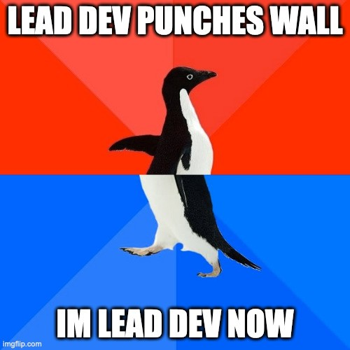
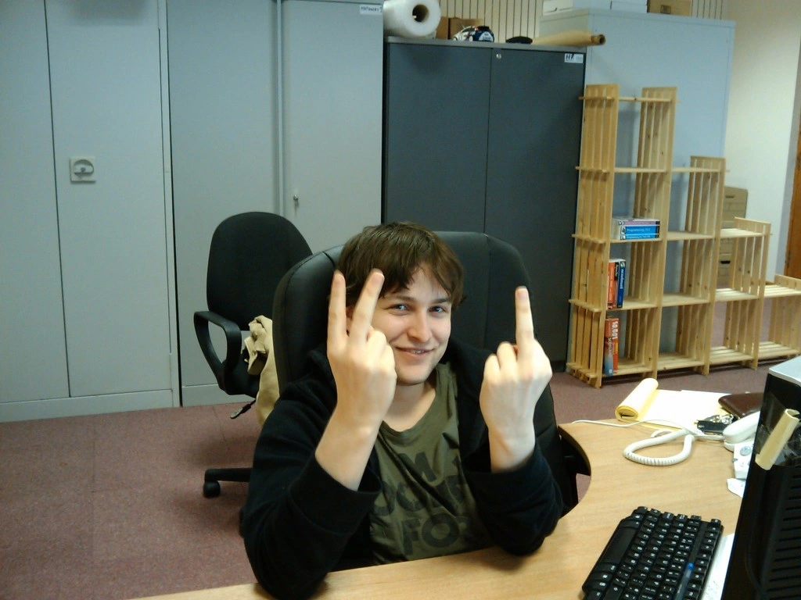
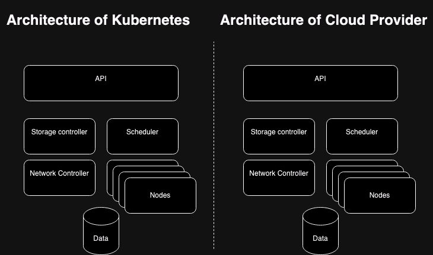

I was extremely lucky in my early career to fall into interesting work.

## Gotta build your brand, yo

After reading the 1000 A4 page Xen manual handed to me by Anders Holm, I
wrote the scheduler for the [first cloud in Europe](https://en.wikipedia.org/wiki/FlexiScale).

```php
function decisionEngine($dbh) {
    $stmt = $dbh->prepare("SELECT id
                           FROM nodes
                           ORDER BY memory
                           LIMIT 1");
    $stmt->execute();
    foreach ($stmt as $row) {
        return $row;
    }
}
```

And history was made.

## Story time

Longer version of the story, and I'm not even sure how much of this is true. I
joined XCalibre Communications Ltd when I was 22, thanks to a wee bit of
nepotism from my favourite brother-in-law Callum Reid. I quickly found myself
working on FlexiScale, the utility elastic computing platform, before the term
cloud was actually coined.

There were people who came before me.

- Ross Blackwood, also a child at the time, was the architect of the system.
  Impressive bastard. Absolutely dominated him at UT99 during the Christmas
  lull though. Noob.
- Duncan Kerr, who I think runs the internet now, only he ran our internet
  back then. He was the one to fix the router after I accidentally PXE booted
  the office. Taught me how to write the networking code without actually
  writing any code.
- Euan Mackay. Walked me through how to PXE, how to rack, and how to manage
  servers. Gave me cabling OCD. I think Euan was probably the glue holding the
  team together.
- Gregor Sim wrote most of the bespoke code that made the thing an actual
  product.


_we did it!_

Everything was going well until the incident. No, not that one, I'll write
about that later — the one where Oracle buys your scheduler and then refuses to
sell you any more licences.

Shit.

Big boss says replace Virtual Iron in 30 days and I'll give you all a grand.
And so we did.

Without a doubt the best job I've ever had.



_Buh Bye, VI_

## Trivia

So here I am in the 2020s, basically the modern day [Tim Berners-Lee](https://www.w3.org/People/Berners-Lee/), having an
interview for a fairly pedestrian platform engineering role — oh how the mighty
have fallen — and they're asking me some of the typical questions you might get
asked.

> Tell me the pros and cons of ECS vs Kubernetes

And I know what they want me to talk about. It's complexity. And I can't give
them that answer. Because it's wrong.

As fortune would have it, I recommended a colleague for the role and he got it.
Some months later, needing more capacity, he vouched for me and got me another
round. He prepped me, told me what they did, who was who, and what they liked.

The interview went really well. I bounced off the interviewer. We melded minds.
You know, where you each know the other has the experience of doing shit, and
you can respect their opinions even if they don't perfectly align with your
own.

Enter stage right, some kid. He was rude, egotistical, and about 30 minutes
late to the interview. He asked me one question.

> Tell me how you like to use argocd

And I knew the answer he wanted me to give. But I couldn't. Because I didn't
agree with it.

But diversity is a good thing, right? Unless, of course, it's diversity of
opinion, knowledge, or experience.

I touched on trivia in [my previous article](/writing/the-hiring-pool/).

At best, given infinite subject matter, trivia questions are a lottery — or a
punishment for having the audacity to put a subject on your CV. Worst case, the ego of an ignorant interviewer rejects the
better answer, or takes licence to pick at the scab of a miss, rather than try
to figure out what you do know.

Everyone thinks they do it well. Few do.

## Memes

Let's go back a bit and revisit the kubernetes complexity meme. Things you need
to configure to run a service in ECS vs EKS.

- ECS: Cluster, Task (Fargate), Service, DNS, Loadbalancer, Security Groups
- EKS: Cluster, Deployment (Fargate), Service, DNS, Loadbalancer, Security
  Groups

Super different, eh?

Alright, alright, I get it. People are talking about the kubernetes
architecture being complex...



_Wait what?_

So I've glossed over some details. The syntax is different, and the important
thing is you already know the cloud architecture. Learning new things is hard,
and you know, they manage it for you, hide some of that complexity, so when
it's doing something weird, you have no way to actually debug the thing.

Instead you just stare into the void of the opaqueness of their shitty
dashboard.

That's a... win... right?

## Discourse

There are two things going on here:

1. There's a configuration vs convention argument. Whilst default EKS is a
   pretty simple offering, similar to ECS, you can customise the shit out of
   it. You can replace the CNI, the CRI, you can run your own node groups, you
   can run serverless workloads. Shit, you can basically install a bunch of
   third-party services and define your own platform. Information overload! But
   it's not actually a configuration vs convention argument; it's configuration
   and convention vs one way to do things with proprietary lock-in. That in
   itself would be fine, if not for the fact that ECS is largely an inferior
   product.
2. Anti-intellectualism. You ever watch Bridget Jones's Diary? Well, I walked
   into a bar in 2013 and now I accidentally have a wife, so I tend to think of
   life lessons in terms of millennial chick flicks. It's the scene where she
   meets the posh people and she talks about Chechnya. This is where we are
   right now. Everyone's memorised the talking points but nobody really knows
   anything about it. Therapy time. It's okay to not know everything. It's okay
   to defer to someone with experience. The loudest voices don't have all the
   answers. If you just wait a second and listen, today you could be one of the [lucky 10,000](https://xkcd.com/1053/).

These arguments persist because we don't look at things how they really are.
Somehow we view these systems as magical achievements which only the big bad
vendor can deliver. Thus we create a narrative that such things are beyond our
reach, and we lurch from vendor to vendor, creating disaster after disaster.

We call it complexity, but it's actually just ignorance.

## Final thoughts

Building FlexiScale was a beautiful place in time and space.

When Oracle put a gun to our heads we didn't meme complexity, we didn't say it
wasn't possible, we didn't go begging to another vendor.

We looked at the problem, designed the simplest architecture that worked, and
we replaced Virtual Iron with something that was significantly more performant,
significantly simpler, and significantly more malleable.

We did it in 30 days. And it wasn't even difficult.

I think back to that time a lot. It took me about 10 years to really understand
what we had in that moment. In 15 years experience across 20 companies, I don't
think I've ever experienced it again.

We had an Engineering Culture.

## Agenda

You know the market is shit when everyone is on LinkedIn building their brand.
Would they be here if they were doing interesting work?

The problem is this brand building is destroying the thing we covet, you know,
besides money.

- You can't have it when you have to be right, even when you're wrong.
- You destroy it when your views are coloured by memes with no substance.
- You snuff it out when you deny expertise.
- It doesn't exist when you have to be the hero of the story.
- It's lost when you don't listen.

And that's sad, because it really was a beautiful moment.

I want it back.

I need it back so bad I'm willing to do better.

And all I'm asking is for you to do the same.

<!-- UNPLACED — these came from the original but I could not tell
     where they sat in the text. Move them into position or delete. -->



_Names changed. The mistakes are still mine._
