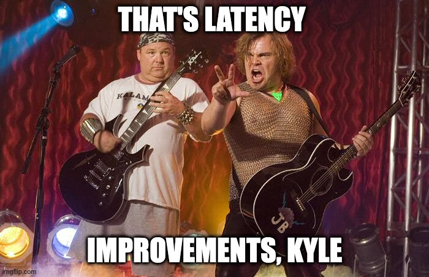

<!-- OPENING — the original starts with a four-line riff on the Fresh Prince
     theme. Paste your own lines back in here; I have left them out rather
     than reproduce the lyric they are built on. -->

Okay, I deserved that. But god dammit Will, why you gotta ruin our childhoods?

So like, anyways, I start this new job and stuff and like, the servers
literally go on fire every lunchtime. Okay Captain Pedantic, they don't
literally burst into flames, but they do stop, like, serving data, and you
know, causing thousands of calls to the help desk, and like hard downtime, for
our customers, who like literally, like really literally, are losing the $$$
because of this.

After a quick scan of the room to like, you know, figure out who's in charge
and is going to deal with this and stuff, I realise it's like... me.

Might have to start writing like an adult now... Nah, fuck that.

So here we are in the war room. We're watching the MSSQL `sp_who2` or whatever.
I'm not really sure what the command is as I've never actually run MSSQL in
production. Who has that kind of $$? But whatever, we're watching the sp_who2
and we're seeing lots of `getSyncData();` getting backlogged and basically not
going away.

The team, who by the way are amazing, are randomly killing queries that are
blocking, because they have no fucking idea what to do. It's not working and my
phone is basically ringing off the hook with people who want to tell me how
much of a terrible person I am.

So here I am furiously writing my resignation when it hits me. "Block MSSQL" I
say. "What?" the retort. "Remove the fucking security group from the fucking
server" I follow with.

They comply. I mean what else they gonna do, apparently I'm the senior and
nobody has any other suggestions, so why the hell not? Within minutes load on
the servers is back to... semi-normal. The security group reattached, or
something — listen, I'm not interested in details about how security groups
work — the security group reattached, the call queues come down, service
returns to normal, and we've saved the day.

Until tomorrow.

## Some background

- `getSyncData();` is basically the stored procedure that syncs events between
  mobile devices. Said mobile devices may be in similar or different locations
  but are owned by an overarching account. The data needs to be sync'd in order
  to perform business critical functions, though an outage of those functions
  is probably better than the "I can't trade" outage we're facing right now.
- Now `getSyncData();` is an MSSQL sproc. The MSSQL cluster is vertically
  sharded 8 ways. The partition metadata is stored in a central MSSQL called
  ASPNET using customer_guid and whatever happened to be the active partition
  for new customers at the time. This also happens to store the Auth N/Z data.
  Some of ASPNET's data, such as the partition metadata, is persisted within a
  non-HA redis cache.
- During an outage, there's a blocking query. This might be `getSyncData();`
  itself, or it might be a different query such as a customer report. Either
  way, you get a backlog of syncs, which results in the clients retrying. This
  results in a cache getting overloaded, falling over, resulting in ASPNET
  dying, and customer Auth N/Z being crippled. Basically a global outage for
  40,000 direct customers, hundreds of thousands of users, and millions of
  consumers interfacing with the thing.

An outage like this is defined as a
[thundering herd](https://en.wikipedia.org/wiki/Thundering_herd_problem) and
the solution we enacted is the manual version of a
[circuit breaker](https://martinfowler.com/bliki/CircuitBreaker.html). Perhaps
there's a better explanation for the solution, but that's what I'm going with.
Now this may or may not work depending on your stack, but the underlying theory
is the clients went away for a bit, and when they came back the server was
better able to handle them. Now we have to productionise this.

## Ways to skin this cat

Alright, some of you smarty pants might have realised that there's a couple of
ways to skin this cat.

I'm going to take the time to explain why those aren't going to work.

But please, I implore you, don't skin a cat. It's just not kind and you'll end
up on the news like that lady that shoved the cat in the bin.

Bad karma.

Without further ado:

- You should fix the cache. Of course we tried, but it still would occasionally
  randomly go down and recreate the clusterfuck. Even if we perfected it, it
  still doesn't change the fact the underlying shards shit the bed when it gets
  too busy.
- You should fix `getSyncData();`. Yes we should, but for some reason I found
  it difficult to get a developer to tackle the 30k LOC SP that has multiple
  parents and children. Seriously, the tables had at least 6 read/write paths
  and anyone who knew what was going on had left, which is why I'm here.
- You should optimise the DB. Of course we did. Probably the best "fix" was to
  switch to an instance with an NVME drive and to place the tmpfile there. This
  bought us a decent amount of time, but also cost $$$$.

Of course, none of this really changes that if you have "an event" (which one
CTO I met called downtime, because they thought downtime was too harsh — mate,
your fucking customers are fucking fucked, grow up) you can't really recover
without some heroic intervention from that one guy who has access to the MSSQL
server.

## Learn to speak product

This is where things get political. I'm sorry dear Product team, but
Engineering are commandeering the roadmap. No more boom and bust!

More to the point, the downtime is causing 3% churn, which extrapolated over 5
years is basically infinity millions of pounds, ergo the most lucrative product
initiative we've ever had.

Learn to speak product; it helps people!

## Fin

So we're coming to the end of our story, and our heroes have put Kafka in front
of the API. This is slightly complicated by the 6 or so indecipherable write
paths, but we've learned to ignore the random hyphen separated values API (very
interesting when we exceeded the MAX_INT on one of the shards and were forced
into the negative integer space) and just look at the data on I/O.

We've updated our read paths to grab `getSyncData();` direct from kafka via
ksql and it was beautiful.

Nah, for fuck sake, it was slow. Does nothing ever fucking work as advertised?

How do Enterprise Architects even do their jobs?

But our heroes were not deterred. They've read Designing Data-Intensive
Applications.

They were ready. This was their moment.

A little bit of hacking here, and a little bit of Cassandra with customer_guid
and timeuuid (which was nice because it helped resolve missing data syncing
problems) there, and a sprinkle. A. SPRINKLE. Of exponential back-off and
jitter on the client, and everything was bright and beautiful. The P50 was down
70%, the P95 down 80% and the P99 down 90%.

Fin.
