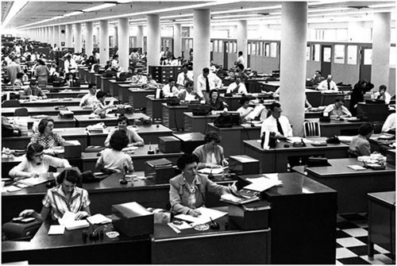
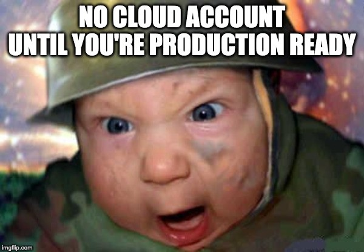
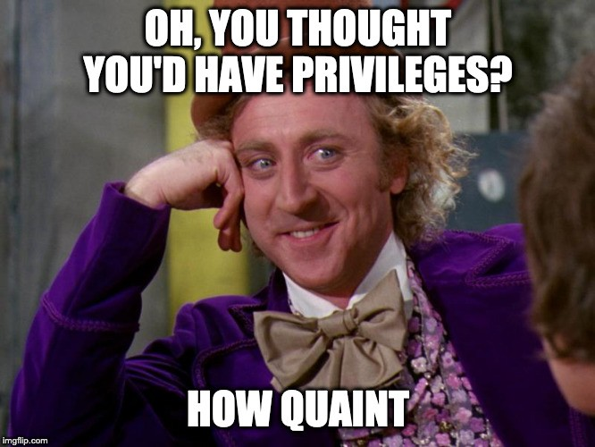
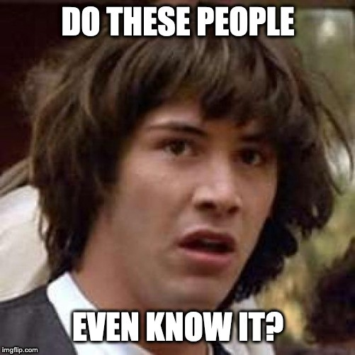
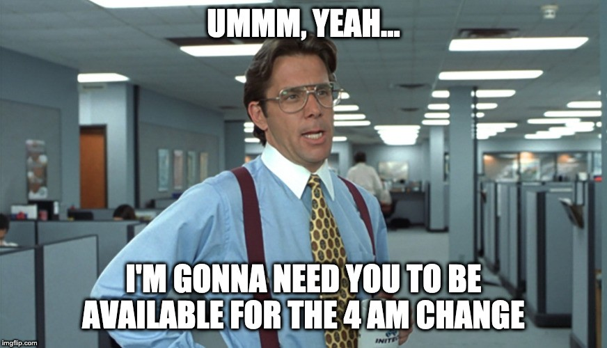
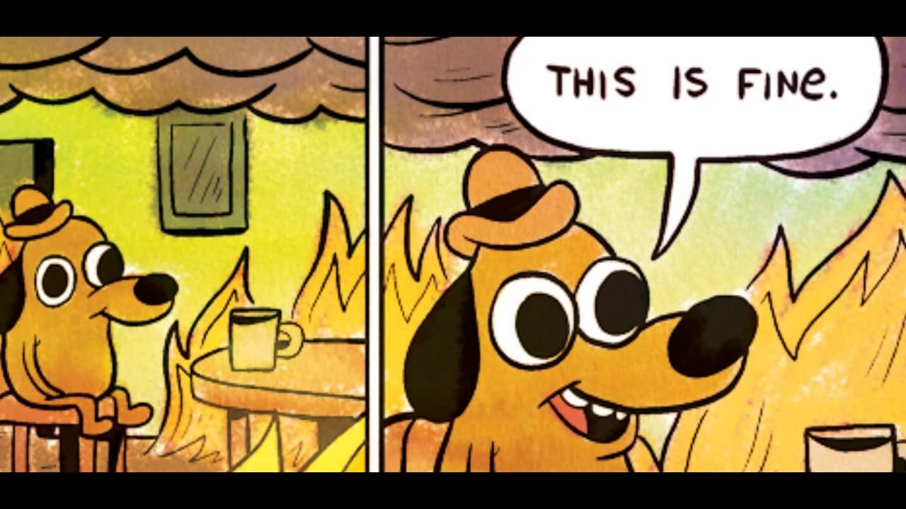

The year is 2020. You've been in the trenches of the British Capital Hotels
transformation programme for the last 6 months. You're gasping for breath. You
haven't seen light in weeks. "Jenkins! Captain Jenkins!" you scream.

He's running headfirst into an Enterprise Wide Cloud Agreement when you haven't
so much as figured out how to deploy a VM. You hear a faint scream, and then
nothing. Nothing but the stench of death. The salesmen have won.

Legacy. Legacy IT never changes.

It all started on a warm summer's morning. You were a bright eyed and bushy
tailed AWS Engineer, full of optimism and hope. You are here to fix British
Capital Hotels. You spend the first few weeks preparing, being indoctrinated in
the ways of Scrum, the one true Agile methodology. Times were simpler back
then.

Bootcamp ends and you're ready to start the real work. Captain Jenkins, the
Scrum Master, welcomes you to his team. He introduces himself as a servant
leader and lets you know if you need anything you just need to ask. You request
an AWS account. It doesn't come. You chase him. Weeks pass, still no account.
You ask Captain Jenkins what the hold-up is; he mumbles something about
Information Security.

After a chance introduction with Patty from InfoSec, you decide to ask about
the account. You try to explain you need the account in order to build a
production ready stack, but the argument falls on deaf ears as Patty rants
about how she'll never connect her network to those bratty Cloud kids.

You wonder how she can have such a disposition when the entire reason you're
here is because of "the Event" within the Legacy IT systems.

Finally, after what seemed like an eternity twiddling thumbs, THE CONSULTANCY
dropships Tom, Dick and Harry to lead the charge. A suit called Bill from
InfoSec wanders in and asks them if they need anything. With a wink and a
smile, you finally get the AWS account and it no longer matters that you've
been waiting for months. You're just happy to have it.

The game's afoot now. We're going to fix the company. You open up your IDE and
write some terraform to deploy a VM and run it. Doesn't work. Fuck sake.

You plan to ask Captain Jenkins to follow up on why your account doesn't have
privileges, but other than stand-ups he's never anywhere to be found. Finally,
you get a meeting with InfoSec and they tell you to submit the terraform to
them, via email, and they'll run it on your behalf. You try to explain how long
that would take. They don't care.

Sigh. You comply.

Days pass and nothing, despite the fact you mention the blocker every day in
the stand-up. You now know where the Information Security Cupboard is, so you
decide to take matters into your own hands. You wander in and speak to Wes. He
says that as long as you install their EDR software, they'll run your change.

Okay, here we go, you get a copy of the software. What the fuck is this? It's a
Windows binary and you're trying to run an Ubuntu VM. You go talk to Wes. He
states, "our requirement is we need you to install the EDR". Fuck it, it's been
months, you install Wine and then the EDR and you let Wes know. He schedules
you into the next change board.

A week on Tuesday comes and the Change Advisory Board commences. The Head of
Project Management, the Head of Enterprise Architecture, and Bill, the CISO,
approve the change of adding a Linux machine into an AWS account with a Windows
EDR running on Wine.

Fuck it, we're putting the app on this franken-server. You write the terraform
against your own personal AWS account. Dick watches in awe. You explain to him
things like infrastructure as code, CIS Benchmarks for security, autoscaling
groups and launch configurations.

Finally, after weeks of late nights the environment is ready. It's been tested,
audited and reviewed. You've jumped through the many additional Information
Security hoops, been approved by the Change Advisory Board, and your team has
been greenlit to connect back to Legacy. It's your time now. Captain Jenkins
mentions that the connectivity needs to happen out of hours.

Your alarm screams at you to wake up at 3:45 in the morning. Your heart pounds
and you have a rising feeling of pain, or maybe just disgust, in your chest.
You joke to yourself you've usually had a lot more fun when you feel this bad.
You compose yourself and dial in.

There's Patty and a BT engineer on the line. They ask if you're ready to run
through the change. You ask them to wait for Dick or Captain Jenkins to join.
They never do. You run the change, but it doesn't work. You don't really know
how to test the connectivity because Dick set it up and assured you that you
wouldn't need to do anything.

It'll be 6 weeks before you get another change window, and this window is
critical in order to meet the deadline of destiny or whatever. You persist.
Eventually you figure out that the Security Group Egress was misconfigured.
It's 5:23 am. You collapse into slumber.

<!-- QUOTE — the original quotes three lines of a song here. Paste it back in
     if you want it; I have left it out rather than reproduce the lyric. -->

You rock up at 10 am expecting a thanks for saving the day. Instead Captain
Jenkins marches over to you and demands to know why you weren't at the 9:30
stand-up. You whimper out your excuses and slouch down into your desk, trying
to remember why you're doing this.

Cheer up. It's all downhill from here. Things are going well; the app has
connectivity and you'll be able to enjoy the sweet nectar of achievement soon.
You have a few things to finish off to make sure the launch goes smoothly. Your
stomach rumbles. Lunchtime has gone and went, but the canteen is open, so you
decide to grab a sandwich. Nobody is around, so you take it back to your desk.
Might as well finish your tickets.

You see an email thanking Dick for all _your_ hard work. Captain Jenkins
returns eating a slice of pizza. He asks why you weren't at the launch party.
Nobody told you about it and you didn't get an invite. He tells you Enterprise
Architecture have just announced they've asked Azure to tender for the
Enterprise Wide Cloud Agreement.

You think, well, it doesn't really matter what cloud you're using. They're all
good, right? You ask for an Azure account. A few more weeks pass. No Azure
account. Your tickets don't move. You try and explain your frustrations in
stand-ups. Captain Jenkins suggests you have an attitude problem.

As the weeks tumble in you're struggling to get a VM onto Azure. AWS is
declared legacy and Captain Jenkins tells you not to bother with it any more.
Dick is made Head of Engineering.

Your contract is not renewed.

## Post credit scene

You're sipping your mojito on the Costa del Sol, scrolling through Apple News.
You notice this headline.

> British Capital Hotels leak 10,000,000 records via an unpatched AWS instance.

You smirk.
